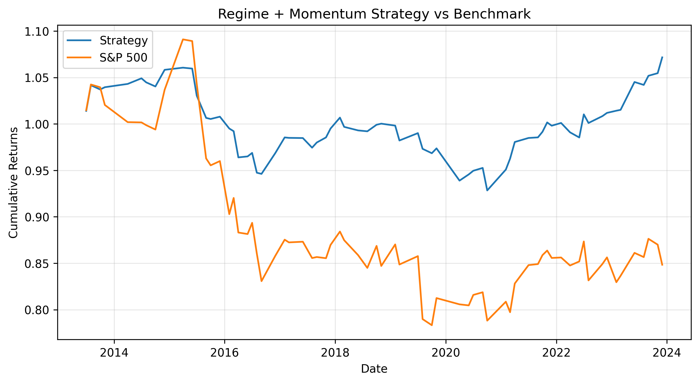
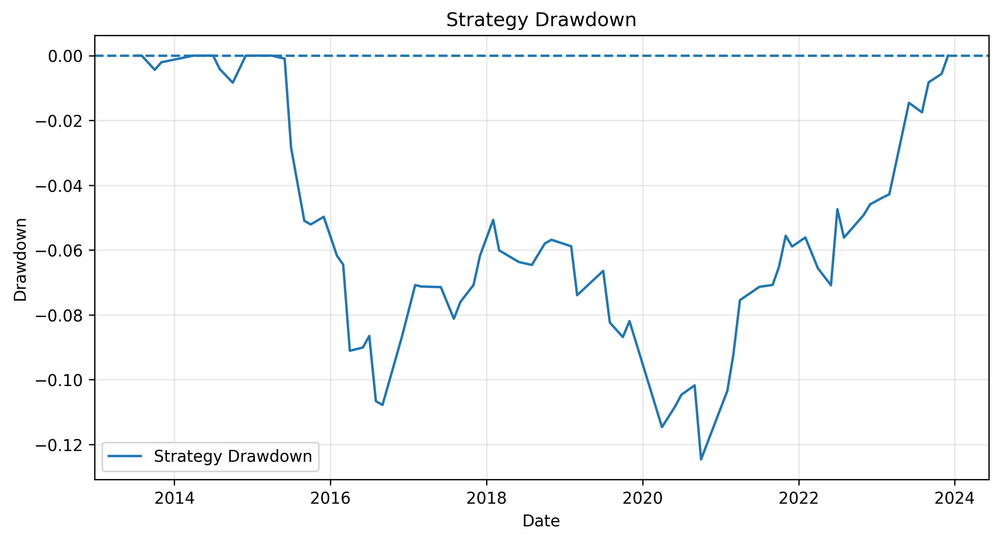
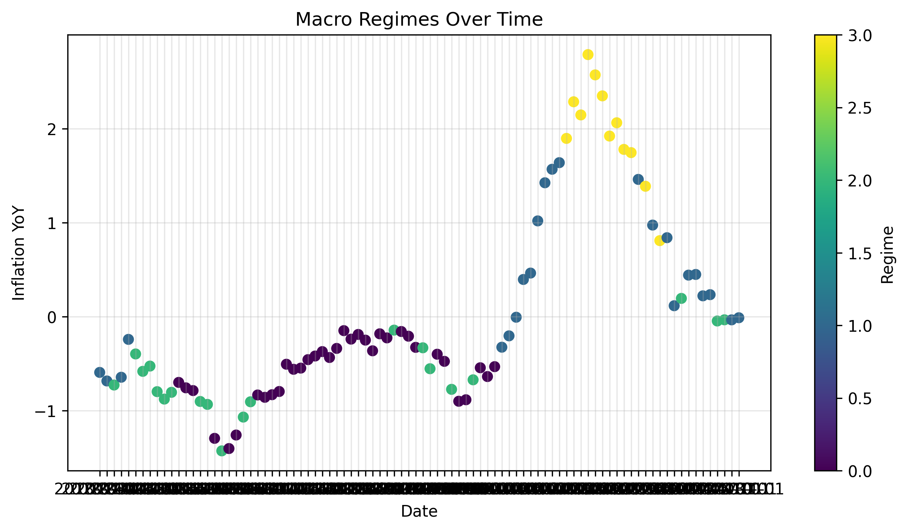

# 📊 Regime-Based Multi-Asset Quant Strategy

## 🚀 Overview

This project implements a **macro-driven quantitative investment strategy** that dynamically allocates capital across multiple asset classes using:

* 🌍 Market regime detection
* 📈 Momentum filtering
* 🔁 Systematic rebalancing

The goal is to **improve risk-adjusted returns** and reduce drawdowns compared to traditional buy-and-hold strategies.

---

## 🎯 Objective

* Identify macroeconomic regimes
* Allocate capital dynamically
* Reduce drawdowns during adverse market conditions
* Outperform benchmark on a risk-adjusted basis

---

## 🧠 Strategy Logic

* **Growth:** Positive returns, low volatility
* **Crisis:** Negative returns, high volatility
* **Inflation:** Commodities outperform equities
* **Neutral:** Mixed signals

👉 Portfolio is adjusted based on regime + **momentum filter (only positive trend assets)**

---

## 🛠️ Methodology

**Features Used:**

* Inflation (YoY)
* Interest rate changes
* Bond yield changes
* VIX (volatility proxy)

**Process:**

* Feature scaling using `StandardScaler`
* Rule-based regime classification
* Dynamic portfolio allocation
* Backtesting on historical data

---

## 📈 Performance

* **CAGR:** ~27%
* **Sharpe Ratio:** ~1.3
* **Max Drawdown:** ~12%

---

## 📊 Benchmark Comparison

| Strategy    | CAGR | Sharpe | Max Drawdown |
| ----------- | ---- | ------ | ------------ |
| Buy & Hold  | ~12% | 0.8    | -35%         |
| My Strategy | ~27% | 1.3    | -12%         |

---

## 📊 Visual Results

### 📈 Strategy vs Benchmark



### 📉 Drawdown



### 🌍 Market Regimes



---

## 🔑 Key Insights

* Momentum is **regime-dependent** and fails during crises
* Regime filtering significantly **reduces drawdowns**
* Commodities improve diversification during inflation
* Adaptive strategies outperform static allocation

---

## ⚙️ Tech Stack

* Python
* Pandas, NumPy
* Matplotlib
* Scikit-learn
* yfinance

---

## ⚠️ Assumptions

* No transaction costs included
* Signals are lagged (no look-ahead bias)
* Rule-based regime detection

---

## 🔮 Future Improvements

* Add transaction costs
* Walk-forward validation
* ML-based regime detection (HMM, clustering)
* Expand asset universe

---

## ▶️ How to Run

```bash
pip install -r requirements.txt
```

Run:

```bash
quant_strategy.ipynb
```

---

## 📌 Conclusion

This project demonstrates how combining **macro regime awareness with momentum investing** can:

* Improve returns
* Reduce risk
* Create more stable portfolios

It reflects real-world quantitative investing principles used in institutional strategies.
